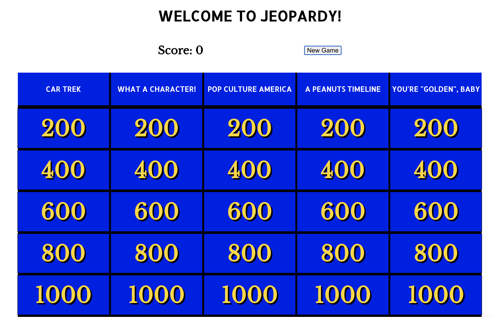
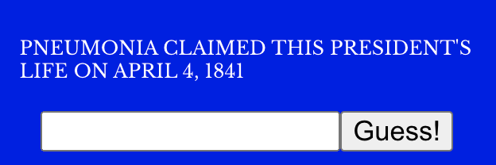

# This is...JEOPARDY! (useEffect & APIs Lab)

## The Goal

## Getting Started

* Clone this repository using `git clone`
* `cd` into the lab
* `npm install`
* `npm start`

## The Lab

1. **Render the Board** - Get sample data to render using the pre-built components & cleaning methods. You can see the sample data in the `sample_data.json` file. Note that we have already built a cleaning function for you called `cleanData`, which is located in `utils.tsx`. While you are welcome to modify this function, you do not have to in order to get the application working. Because the cleaning function re-organizes the data, be sure to log the cleaned data so you understand the structure you'll be working with. The component structure is set up like:
    * App - we'll be making our API calls from this level of the application
        * Board - the Board component holds all columns and rows of the game board. it receives the full, cleaned data structure as a prop.
            * Category - the Category component holds a single column from the game board. It receives two props currently - the `name` of the category and an array of `cards` (each of which is an object containing information about a single clue).
                * Card - the Card component is a single square of the game board. It receives a `data` prop, which is an object containing information about a single clue (one element from the `cards` array received by the Category component). 
1. **API Calls** - For this step, make a call to the [JService API](https://jservice.io) with in the `callAPI` function in the `utils.tsx` file.
1. **Render API Data** - Get API data to render using useEffect hook. You'll know this is working when you get a different set of categories and clues every time you refresh the page! 
1. **New Game Button** - Add a "new game" button that refreshes the tiles to a new set of clues (by making a new call to the API).
1. **Answer Box** - Add "answer" box and submit button. When a user submits an answer, check to see if it's right (using the answer property for that clue) and update the score appropriately.

1. **Answer on the Card Front** - Ensure that clues that have already been answered now display the answer on the front of the card, and cannot be clicked again.

## Extensions

* **Styling** - Update the styling to be even closer to the actual jeopardy game - we leave this up to your creativity!
* **Responsiveness** - Update the styling to ensure the game is responsive on all standard screen sizes
* **Data Cleaning** - Some clues have images that are not included, rendering the clues useless. Others have `<i>` tags, and still others have parenthtical annotations. All of these make the questions difficult to answer in this format. Implement advanced data cleaning to handle these exceptions. We've given you a starter cleaning function called `cleanAnswer` in the `utils.tsx` file. Consider using:
  * Regex
  * Fuzzy string matching algorithms/libraries
* **One at a Time** - Currently, it is possible to open more than one clue at a time. Fix this bug so that only one clue can be open at any one time!
* **Turn-based** - Convert the game to a turn-based game so that multiple people can participate and answer questions. Keep score for each team/person.
